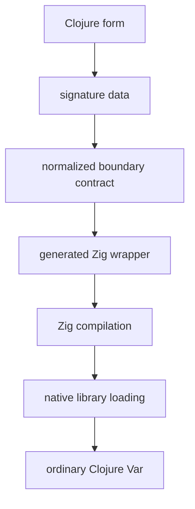

# clj-zig

[](https://github.com/leifericf/clj-zig/actions/workflows/ci.yml)


An experiment in defining ordinary Clojure functions backed by real Zig.

Stay in the REPL, define a function in a familiar shape, and drop into Zig only where native performance, explicit layout, comptime, or low-level control earns its keep.

The name is descriptive rather than clever: `clj` for Clojure, `zig` for the Zig that backs each function.

## Core idea

```clojure
(defnz add
  "Adds two signed integers."
  [x :i64
   y :i64
   :ret :i64]
  "return x + y;")

(add 20 22)
;; => 42
```

A normal Clojure function. The body is real Zig. The signature vector is a Clojure data contract describing the boundary.

## A wider tour

The signature vector is the whole contract. Widen it one type at a time.

```clojure
;; A slice arrives as a primitive array; :const makes it read-only.
(defnz sum
  [xs [:slice :const :f64]
   :ret :f64]
  "var t: f64 = 0; for (xs) |x| t += x; return t;")

(sum (double-array [1.0 2.0 3.0]))
;; => 6.0
```

Named boundary types cross by value. A `defrecordz` returns a Clojure record:

```clojure
(defrecordz Point [x :f64 y :f64])

(defnz midpoint
  [a Point
   b Point
   :ret Point]
  "return .{ .x = (a.x + b.x) / 2.0, .y = (a.y + b.y) / 2.0 };")

(midpoint (->Point 0.0 0.0) (->Point 4.0 6.0))
;; => #user.Point{:x 2.0, :y 3.0}
```

A `defenumz` member bridges to a keyword. clj-zig copies an `[:owned [:slice T]]` return into a vector and frees the native memory; a `[:handle T]` is an opaque native resource the caller frees. Errors cross as data and allocations stay explicit. The [Boundary Contract](docs/03-boundary-contract.md) lists the full type vocabulary.

## Bigger bodies and C interop

A body can also live in a real `.zig` file instead of a string. The file is ordinary Zig with full editor and `zig fmt` support; the generated wrapper calls its `pub fn`. The descriptor can link C libraries too, so a body may `@cImport` a C header directly:

```clojure
(defnz hypotenuse
  [a :f64 b :f64 :ret :f64]
  {:zig/file "hyp.zig" :zig/link ["m"]})
```

```zig
// hyp.zig
const c = @cImport({ @cInclude("math.h"); });
pub fn hypotenuse(a: f64, b: f64) f64 {
    return c.sqrt(a * a + b * b);
}
```

The file path resolves next to the source file, then on the classpath. See [ADR 26](docs/adr/26-external-zig-source-files.md) and [ADR 27](docs/adr/27-compile-options-c-interop.md).

## Inspect and redefine

Every function is an ordinary Var carrying its spec, source, and build status:

```clojure
(zig/spec #'sum)               ;; the normalized boundary contract, as data
(zig/generated-source #'sum)   ;; the full Zig wrapper
(zig/source #'sum)             ;; the body you wrote
```

Redefine like any `defn`, and a fresh library compiles. When a new body fails to compile, the diagnostic prints and the last good binding stays callable.

## Pipeline



## Examples

The [`examples/`](examples/) directory holds small, runnable programs. Load one
in a REPL and evaluate its `(comment ...)` block. The basics cover each boundary
type one file at a time. Four go further, into work that is hard or impossible
from the JVM:

- [`simd.clj`](examples/simd.clj): explicit SIMD over `@Vector` registers.
- [`memory_layout.clj`](examples/memory_layout.clj): a packed native buffer mutated in place, no allocation, no GC.
- [`bit_ops.clj`](examples/bit_ops.clj): sub-byte packing and single-instruction bit intrinsics.
- [`inline_asm.clj`](examples/inline_asm.clj): inline assembly, with the bodies in sibling `.zig` files.

And [`cinterop.clj`](examples/cinterop.clj) imports a C header with `@cImport` and links a C library, its body in a sibling `.zig` file.

## Reading order

1. [Vision Brief](docs/01-vision-brief.md): what clj-zig is, who it serves, what counts as success.
2. [Interface Design](docs/02-interface-design.md): `defnz` and the family of z-suffixed forms.
3. [Boundary Contract](docs/03-boundary-contract.md): how values cross and the type vocabulary.
4. [REPL and Execution Model](docs/04-repl-and-execution-model.md): redefinition, caching, diagnostics.
5. [Composability and Builders](docs/05-composability-and-builders.md): data-level reuse and macros.
6. [Proof-of-Concept Plan](docs/06-proof-of-concept-plan.md): scope, phases, acceptance tests.
7. [Design Principles and Decisions](docs/07-design-principles-and-decisions.md): the principles; decisions are ADRs in [docs/adr/](docs/adr/README.md).
8. [Test Strategy](docs/08-test-strategy.md): how generative and exhaustive testing prove the boundary, layered on the example suite.

## Requirements

- **Java 22 or newer.** clj-zig uses the finalized Foreign Function & Memory
  API (JEP 454); `--enable-preview` is not required. The only flag the JVM
  needs is `--enable-native-access=ALL-UNNAMED`, which the `:test` alias sets.
- **Zig 0.16.** clj-zig shells out to `zig` to compile generated source.
- **Clojure CLI** (`deps.edn`, not Leiningen).

Development runs on JDK 26. If your shell's default JDK is older (for example
through sdkman), point the Clojure CLI at JDK 26 for one invocation using
`JAVA_CMD`:

```bash
JAVA_CMD="$(/usr/libexec/java_home -v 26)/bin/java" clojure -M:test
```

## Installation

Install the toolchain, then depend on clj-zig. On macOS with Homebrew:

```bash
brew install zig clojure/tools/clojure
brew install --cask temurin
```

Use your platform's usual installer elsewhere. clj-zig reads `zig` from the
path, so confirm the versions:

```bash
zig version       # 0.16.x
java -version     # 22 or newer
clojure --version
```

clj-zig is not published to a package repository yet. Depend on it from git
in your `deps.edn`, pinning a commit, and open native access at runtime:

```clojure
{:deps {io.github.leifericf/clj-zig {:git/sha "<commit-sha>"}}
 :aliases
 {:dev {:jvm-opts ["--enable-native-access=ALL-UNNAMED"]}}}
```

Or clone the repository and work from its REPL.

## Running the tests

```bash
clojure -M:test
```

Pure-core tests (signature, type, spec, source) run on any JDK 22+. The shell
tests compile and load native code, so they need `zig` on the path and JDK 22+.

## Non-goals for the proof of concept

- No Zig-to-Clojure callbacks.
- No embedded JVM from Zig.
- No arbitrary Clojure object marshalling.
- No hiding of Zig's type system.
- No production packaging before the REPL experience is proven.
- No DSL that pretends to be Zig but is not.

## License

Released under the [MIT License](LICENSE).
