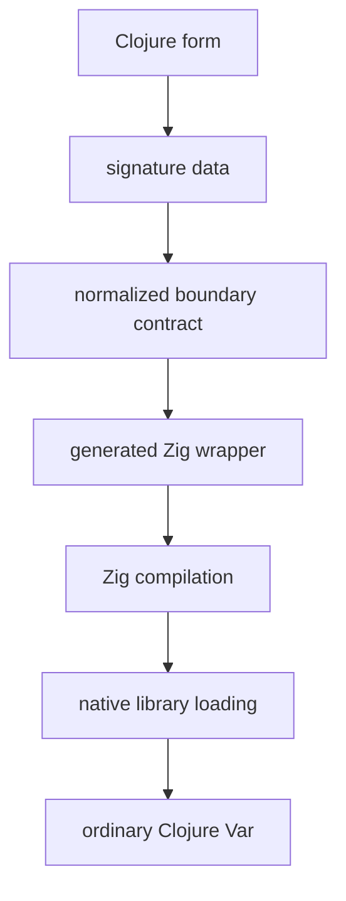

# Zigar

An experiment in defining ordinary Clojure functions backed by real Zig.

Stay in the REPL, define a function in a familiar shape, and drop into Zig only where native performance, explicit layout, comptime, or low-level control earns its keep.

The name shortens `Zigarette`: to a Clojure programmer, native code can feel a little dirty, like smoking. It also inverts "close, but no cigar." Zigar aims for the opposite, a narrowly achieved success.

## Core idea

```clojure
(defnz add
  "Adds two signed integers."
  [x :i64
   y :i64
   :ret :i64]
  "return x + y;")

(add 20 22)
;; => 42
```

A normal Clojure function. The body is real Zig. The signature vector is a Clojure data contract describing the boundary.

## Pipeline



## Reading order

1. [Vision Brief](docs/01-vision-brief.md): what Zigar is, who it serves, what counts as success.
2. [Interface Design](docs/02-interface-design.md): `defnz` and the family of z-suffixed forms.
3. [Boundary Contract](docs/03-boundary-contract.md): how values cross and the type vocabulary.
4. [REPL and Execution Model](docs/04-repl-and-execution-model.md): redefinition, caching, diagnostics.
5. [Composability and Builders](docs/05-composability-and-builders.md): data-level reuse and macros.
6. [Proof-of-Concept Plan](docs/06-proof-of-concept-plan.md): scope, phases, acceptance tests.
7. [Design Principles and Decisions](docs/07-design-principles-and-decisions.md): principles and the decision log.

## Non-goals for the proof of concept

- No Zig-to-Clojure callbacks.
- No embedded JVM from Zig.
- No arbitrary Clojure object marshalling.
- No hiding of Zig's type system.
- No production packaging before the REPL experience is proven.
- No DSL that pretends to be Zig but is not.
